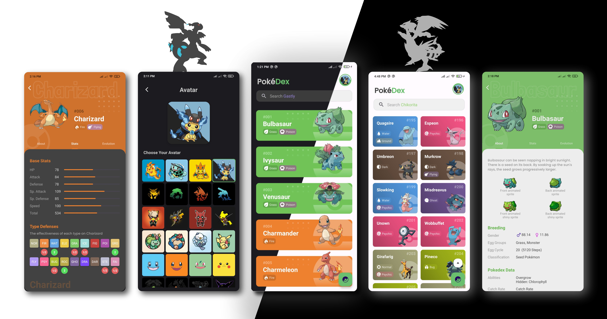

# Pokedex Android App

Welcome to the README file for the Pokedex Android app built with Kotlin. This app integrates an Image Classification Machine Learning model as a backend, hosted on AWS using a Flask API. The app serves as a comprehensive guide to Pokemon, featuring a delightful user interface with support for both dark and light modes.

## Table of Contents

- [About the Project](#about-the-project)
  - [Features](#features)
  - [Screenshots](#screenshots)
- [Tech Stack](#tech-stack)
  - [Backend](#backend)
  - [Frontend](#frontend)
- [Architecture](#architecture)
- [Usage](#usage)
- [License](#license)
- [Contact](#contact)

## About the Project

The Pokedex Android app is designed to provide users with an intuitive and captivating experience while exploring the world of Pokemon. It combines a state-of-the-art Machine Learning model with a user-friendly interface to offer features like Pokemon information browsing, image classification, and customization options.

### Features

- Browse and explore information about all Pokemon generations.
- Switch between dark and light themes for a comfortable experience.
- Integrated Search feature by name, type or number for ease of access
- Use the camera or upload images to identify Generation 1 Pokemon.
- Collect all Generation 1 Pokemon by scanning them with the integrated feature.
- Enjoy smooth transitions and animations for an appealing interface.

### Screenshots

Here are some screenshots showcasing the app's user interface and features:

<i>Light Mode</i>

<i>Dark Mode</i>

## Tech Stack

### Backend

- **Machine Learning Model:** Utilizing TensorFlow's Transfer Learning, incorporating EfficientNet and ResNet models for accurate image classification.
- **AWS Services:** Hosting the Machine Learning model on Amazon Web Services for scalability and reliability.
- **Flask API:** Serving as a bridge between the app and the Machine Learning model, processing image data and returning predicted Pokemon details.

### Frontend

- **Language:** Kotlin
- **Architecture:** MVVM (Model-View-ViewModel) pattern for clean separation of concerns.
- **Network Calls:** Retrofit library for efficient API calls and data loading.
- **UI Components:** 
  - RecyclerView: Smooth lists for displaying Pokemon information.
  - Glide: Seamless image loading and caching.
  - Material Components: Consistent UI elements and themes for an attractive look and feel.
- **Asynchronous Operations:** Coroutines for handling asynchronous tasks efficiently.

## Architecture

The Pokedex Android app follows the MVVM (Model-View-ViewModel) architectural pattern, facilitating a clean and modular structure for efficient development and maintenance. This pattern divides the app into three distinct components:

- **Model:** Responsible for managing the data and business logic. This includes the Machine Learning model hosted on AWS, data structures, and repositories crucial for app functionality.

- **View:** Focuses on presenting the user interface elements and handling user interactions. The app's screens, themes, and animations are managed within the View component.

- **ViewModel:** Acts as a bridge between the Model and the View. It holds UI-related data and logic, facilitating communication between components while maintaining data integrity.
  

By adopting the MVVM architecture, the Pokedex app gains several benefits:

- **Separation of Concerns:** Each component has a well-defined responsibility, leading to a structured and easily maintainable codebase.

- **Testability:** Business logic within the ViewModel can be independently tested, enhancing overall reliability.

- **Scalability:** Adding features or making changes becomes more straightforward, as components remain isolated.

- **Data Binding:** Coupled with ViewModel, data binding streamlines UI-data interaction, resulting in a smoother user experience.

In essence, the MVVM architecture empowers the Pokedex app with a foundation that promotes code quality, maintenance efficiency, and a delightful user experience. It seamlessly integrates various technologies and libraries while laying the groundwork for future enhancements.

## Usage

- Explore Pokemon information across generations.
- Identify Generation 1 Pokemon using the integrated ML model.
- Collect all Generation 1 Pokemon by scanning them.
- Customize the app's theme through the profile page.

## License

This project is licensed under the [Apache-2.0 license](https://github.com/nirajk24/Pokedex/blob/main/LICENSE). See the [Apache-2.0 license](https://github.com/nirajk24/Pokedex/blob/main/LICENSE) file for details.

## Contact

Have questions or feedback? Feel free to reach out:

- LinkedIn: [Niraj](https://www.linkedin.com/in/nirajk24/)
